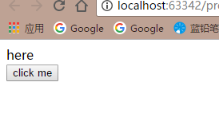
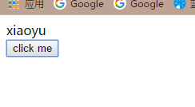

# fetch-promise
fetch方法联合promise的使用demo
由于fetch本身就是支持promise规范的，所以呢可以说只要是使用了fetch API来请求数据，那么天生的就可以使用promise中的then方法来链式调用，
以下是js部分的代码
          var fetchData = function(){
            window.fetch('./mock.json').then(function(response){
            response.json().then(function(data){
              hh.innerHTML = data.firstName;
              console.log(data);
            })
            })
          }
#### 页面渲染为一行文字，下面一个按钮，当点击按钮的时候，使用浏览器fetchAPI请求到本地mock的json数据，请求成功后在then方法的回调中对第一行中的文本
进行更改。
页面截图如下:
未点击时候

点击之后:
